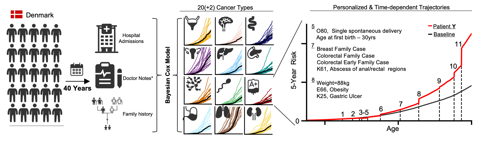

# **Multi-cancer risk stratification based on national health data.**

## **Paper**
[medRxiv](https://www.medrxiv.org/content/10.1101/2022.10.12.22280908v1)

## **Website**
[Explore Results](https://alexwjung.github.io/CancerRisk/webpage/index.html)

## **Description**
Health care is experiencing a drive towards digitisation and many countries are
implementing national health data resources. Digital medicine promises, among other things,
to identify individuals at elevated risk of disease who may specifically benefit from
intervention. This is particularly needed for cancer where early detection improves
outcomes.
While a range of cancer risk models exists, the utility of national resources for risk
stratification across cancer types has not been fully explored.
We use time-dependent Bayesian Cox Hazard models built on modern machine learning
frameworks to scale the statistical approach to 6.7 million Danish individuals covering 193
million life-years. A set of 1,392 covariates from available clinical disease histories, basic
health parameters, and family histories are used to train predictive models of 20 major
cancer types.
Performance is internally validated on the Danish population between 2015-2018 and
externally validated on 0.35 million individuals in the UK Biobank.
The predictive performance of models was found to exceed age-based predictions in all but
one cancer type. The top one risk percentile of the population experiences a hazard ratio of
around 2 compared to age-matched individuals.
Risk-adapted cohorts would on average include 25% of individuals younger than age-based
cohorts with the same incidence.
Data available in national electronic health databases enable cancer risk predictions in most
cancer types. Model predictions generalise between the Danish and UK health care systems
and may help to enable cancer screening in younger age groups.

## **Getting started**

This directory contains the scripts accompanying the paper:

*Multi-cancer risk stratification based on national health data: A retrospective modelling and validation study*

The analysis is split by the two main cohorts: [Denmark](./main/Denmark) and [UK Biobank](./main/UKB).  

The used scripts can be found in the above mentioned folders.

The model parameters can be downloaded from [drive](https://drive.google.com/file/d/1PWsmL8f9w0hGZp9rbg_SQar82TTXVvvi/view?usp=sharing)
An example on how to use the model to predict cancer risk see: (the download of the model file may need changing.):
[Example](./example/cancerrisk.ipynb) - [Colab](https://colab.research.google.com/drive/1q75iFgjojjx1kk8r-MwSLKs9GXzodL4Z?usp=sharinghttps://colab.research.google.com/drive/1q75iFgjojjx1kk8r-MwSLKs9GXzodL4Z?usp=sharing)

## Additional information

### **Citing**
@article{jung2022multi,
  title={Multi-cancer risk stratification based on national health data: A retrospective modelling and validation study},
  author={Jung, Alexander Wolfgang and Holm, Peter Christoffer and Gaurav, Kumar and Hjaltelin, Jessica Xin and Placido, Davide and Mortensen, Laust Hvas and Birney, Ewan and Brunak, Søren and Gerstung, Moritz},
  journal={medRxiv},
  year={2022},
  publisher={Cold Spring Harbor Laboratory Press}
}

### **License**
[MIT License](./LICENSE)

## **Acknowledgement**
This project was supported by grant NNF17OC0027594 from the Novo Nordisk Foundation.
The data for the UK Biobank was accessed by application 45761.
